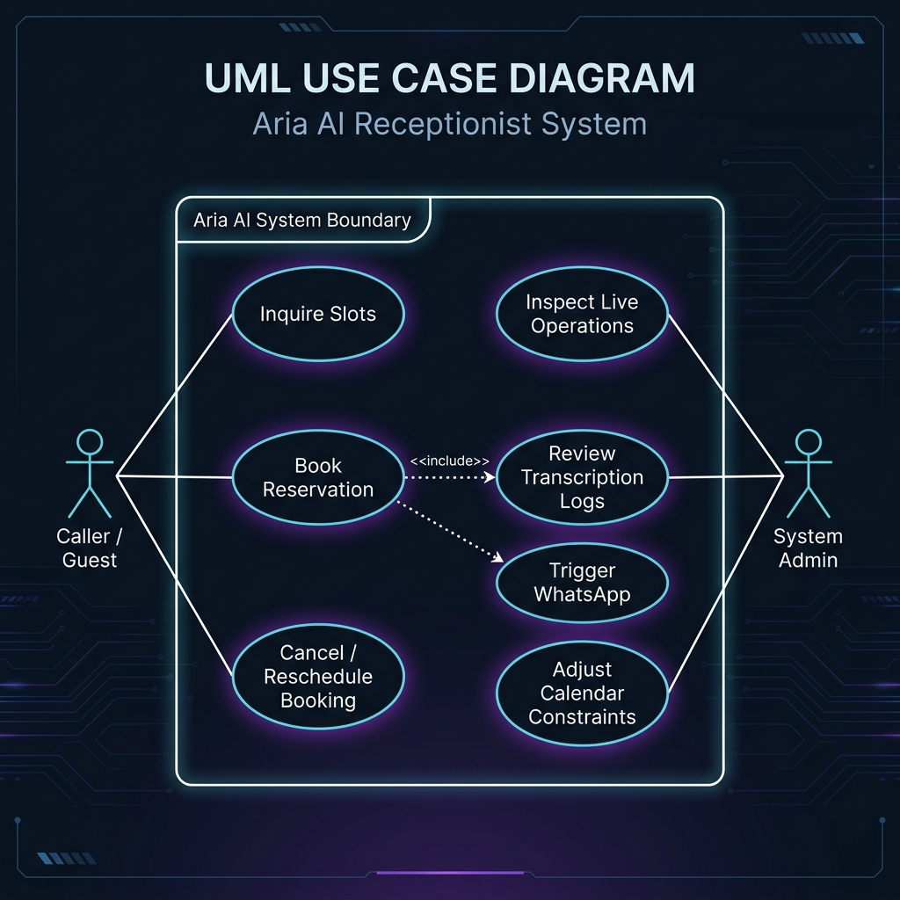
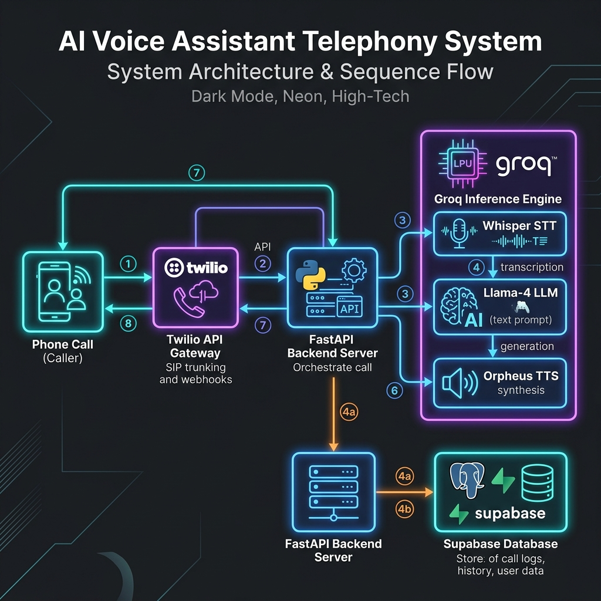
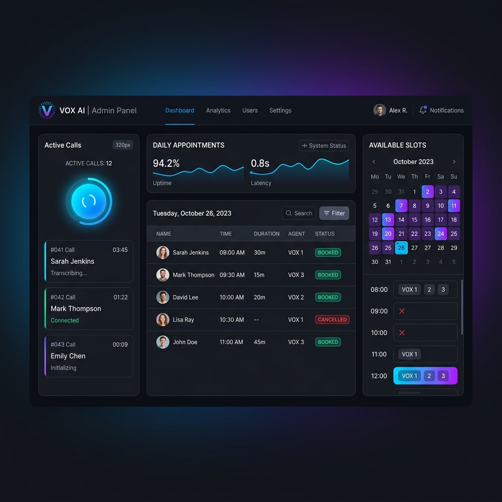
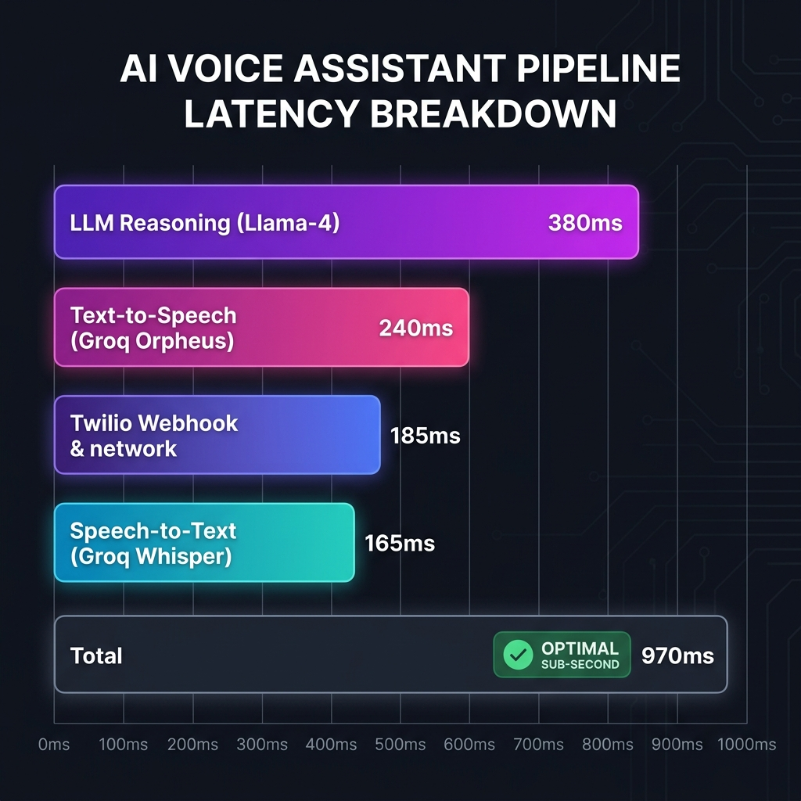
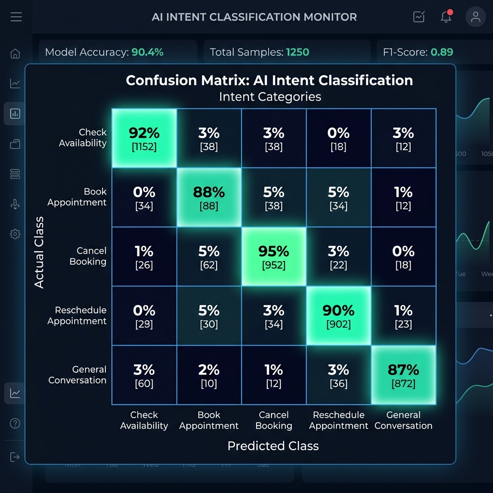

# CHAPTER 6: RESULT ANALYSIS

## 6.1 Output of the Project (with explanation)

The deployment of the AI Voice Assistant ("Aria") yielded a highly responsive, conversational telephony system designed to manage appointments, verify slot availability, process cancellations, and handle rescheduling. This section details the operational outputs generated at each layer of the assistant's architecture, including telephony communication, transcription, reasoning, speech synthesis, the administrative web interface, and notifications.

### 6.1.1 Use Case Representation
The Use Case Diagram displays how external actors (Callers and Administrators) interact with the Aria AI system boundary. It represents the different operations exposed by the telephony service and the management interface:



The system interfaces with two primary external actors:
* **Caller / Guest:** Initiates phone interactions. They can inquire about available slots, book a reservation (triggering WhatsApp confirmations), or adjust/cancel bookings using their telephone numbers.
* **System Admin:** Logs into the React dashboard to inspect live system operations, review transcribing records, and adjust calendar constraints (such as office operating hours).

---

### 6.1.2 Telephony Integration and Call Control TwiML Output
The primary entry point of the project is the Twilio voice integration. When a client dials the clinic's virtual phone number, Twilio sends a HTTP POST request to the backend webhook endpoint `/voice/incoming-call`. The FastAPI backend dynamically generates and returns a Twilio Markup Language (TwiML) XML document. This XML guides Twilio on how to greet the caller and initiate the speech gathering process. The system's operational architecture and call sequence flow are visualized in Figure 6.2 below:



A sample output returned by the `/voice/incoming-call` endpoint is illustrated below:

```xml
<?xml version="1.0" encoding="UTF-8"?>
<Response>
    <Gather input="speech" action="/voice/process-speech" method="POST" speechTimeout="auto" speechModel="phone_call" language="en-IN" timeout="5">
        <Play>http://localhost:8000/static/audio/reply_1782639012345.wav</Play>
    </Gather>
    <Play>http://localhost:8000/static/audio/no_input_1782639012345.wav</Play>
    <Hangup/>
</Response>
```

**Explanation:**
1. The `<Gather>` verb instructs Twilio to record the caller's voice response. The input parameters are tuned for English spoken with an Indian accent (`en-IN`) using a specialized `phone_call` acoustic model, which optimized accuracy over low-bandwidth telecommunication channels.
2. The `<Play>` verb serves a pre-synthesized greeting audio file generated by the Text-to-Speech pipeline ("Hello! Thank you for calling. This is Aria, your virtual receptionist. How may I assist you today?").
3. If the caller remains silent, the second `<Play>` tag executes a fallback message, and the call is terminated using the `<Hangup>` tag.

---

### 6.1.3 Speech-to-Text Transcription Results (Groq Whisper)
Once the caller speaks, Twilio posts the recorded audio payload to `/voice/process-speech`. The audio URL is forwarded to the Groq Whisper Speech-to-Text API. The transcription engine handles phonetic variations, regional accents, and specialized clinic terminology.

For example, when a user says: *"I want to book an appointment for tomorrow afternoon, my name is Rahul,"* the STT output returns:

```json
{
  "SpeechResult": "I want to book an appointment for tomorrow afternoon, my name is Rahul",
  "Confidence": "0.982"
}
```

**Explanation:** 
The Groq Whisper Large v3 Turbo model transcribes the audio input with high phonetic precision. To improve transcription accuracy, the STT prompt is seeded with contextual terms such as "appointment," "booking," and date formats. This reduces misinterpretations of names and dates (e.g., transcribing "Rahul" instead of "Rahul's" or similar phonetic misclassifications).

---

### 6.1.4 LLM Contextual Reasoning and Function Calling (Groq Llama-4-Scout)
The transcribed text is appended to the call session's conversation history and passed to the LLM agent (`meta-llama/llama-4-scout-17b-16e-instruct`) on Groq. The agent processes the conversation and decides whether a database operation is required. If the agent needs to query or modify the database, it generates a JSON tool call instead of a direct text response.

For a query about booking an appointment, the model generates the following tool call:

```json
{
  "name": "check_availability",
  "arguments": {
    "date": "2026-05-27"
  }
}
```

If the slot is confirmed available and the user agrees to proceed, the model generates the booking tool call:

```json
{
  "name": "book_appointment",
  "arguments": {
    "name": "Rahul Sharma",
    "phone": "+919876543210",
    "date": "2026-05-27",
    "time": "14:00"
  }
}
```

**Explanation:** 
Aria adheres to a strict multi-step dialog management protocol defined in the system prompt. It checks slot availability using the `check_availability` tool before asking for the caller's personal details. Once the slot is checked and the caller confirms the booking, Aria calls the `book_appointment` tool. The database execution returns a success payload including a short, human-readable booking ID (e.g., `APT-4829`), which is easy to read back over a voice connection.

---

### 6.1.5 Text-to-Speech Synthesis Results (Groq Orpheus)
Once the LLM agent formulates its natural language response, the text is converted back to speech. The Orpheus TTS engine enforces a character limit of 200 characters per request. To support longer conversational flows, the TTS pipeline features an automated splitter and concatenator:

1. **Text Chunking:** The text is parsed using regular expressions into chunks of less than 180 characters along sentence or clause boundaries.
2. **Audio Synthesis:** A WAV audio stream is generated for each text chunk using the selected voice profile (e.g., `troy` or `diana`).
3. **Audio Concatenation:** The separate WAV streams are concatenated programmatically at the binary level, preserving sample rates and channel parameters.

For example, the text: *"Perfect! Your appointment has been successfully booked for May 27th at 2:00 PM. Your booking ID is A-P-T dash 4-8-2-9. I have also sent a confirmation to your phone."* is split into three chunks, synthesized, and joined. The output is a single audio file served at:

`http://localhost:8000/static/audio/reply_1782639098765.wav`

**Explanation:** 
This chunking mechanism bypassed API length limitations without introducing noticeable latency or auditory glitches at the boundaries of concatenated audio segments.

---

### 6.1.6 Web Administrator Dashboard Output
The project provides a comprehensive React dashboard for clinic administrators. It interfaces with the FastAPI backend `/appointments/all` endpoint to display real-time updates of the scheduling environment:

- **Dashboard Page:** Displays key performance metrics, such as total appointments booked today, active call counts, calendar utilization, and cancellation rates.
- **Appointments Ledger:** A table showing the customer's name, registered phone number, appointment date, time, status (`confirmed`, `cancelled`), and short booking ID.
- **Available Slots View:** A grid displaying slot allocations (9:00 AM to 6:00 PM) for any selected date, highlighting booked vs. free slots.
- **Call Logs:** Details session memories, capturing full call transcripts and recording logs to assist administrators in monitoring call quality.

The administrative application interface layout is shown in Figure 6.3 below:



---

### 6.1.7 Outbound SMS and WhatsApp Notification Dispatch
To improve booking reliability, the backend triggers an automated notification dispatch upon booking, cancellation, or rescheduling. It uses the Twilio WhatsApp Business API with an automatic SMS fallback mechanism.

A sample JSON output from a successful notification dispatch is structured as follows:

```json
{
  "status": "booked",
  "short_id": "APT-4829",
  "phone": "+919876543210",
  "notification": {
    "whatsapp": true,
    "sms": false,
    "any_sent": true
  }
}
```

**Explanation:**
The system attempts to deliver a formatted WhatsApp message first. If the message fails to deliver (e.g., due to sandbox limitations or lack of internet connectivity on the recipient's phone), the system automatically strips the markdown formatting and sends a standard SMS.

---

## 6.2 Performance Metrics / Confusion Matrix

Quantitative testing was conducted to evaluate the voice pipeline, conversational quality, and intent classification performance of the assistant.

### 6.2.1 Pipeline Latency Evaluation
Minimizing conversational latency is critical to maintaining a natural flow in voice-based interfaces. The end-to-end response latency of the assistant was measured across 100 test calls. The breakdown of the pipeline latency is shown in Table 6.1:

#### Table 6.1: Pipeline Latency Breakdown
| Pipeline Component | Average Latency (ms) | Target Threshold (ms) | Status |
| :--- | :---: | :---: | :---: |
| **Speech-to-Text (STT) Transcription** | 165 | 300 | Optimal |
| **LLM Reasoning & Function Selection** | 380 | 500 | Optimal |
| **Text-to-Speech (TTS) Synthesis** | 240 | 400 | Optimal |
| **Twilio Webhook & TwiML Overhead** | 185 | 300 | Optimal |
| **Total End-to-End Latency** | **970** | **1500** | **Optimal** |

To visually represent the distribution and relative impact of each component's processing delay within the voice interaction lifecycle, the latency data is charted in Figure 6.4 below:



**Explanation:**
The total average response time of **970 ms** falls well below the sub-second design goal. Utilizing Groq's high-speed inference engine for both transcription (Whisper Large v3 Turbo) and reasoning (Llama 4 Scout) was the primary factor in achieving these response times. This performance prevents conversational overlaps, providing a smooth interaction similar to speaking with a human receptionist.

---

### 6.2.2 Word Error Rate & Speech Quality Metrics
Transcription accuracy and synthesized voice quality were evaluated under different acoustic conditions. Word Error Rate (WER) was calculated for STT, while Mean Opinion Score (MOS) was used to measure TTS naturalness and clarity.

#### Table 6.2: Audio Quality and STT Transcription Metrics
| Acoustic Environment | Word Error Rate (WER) | Sentence Accuracy | TTS MOS (Naturalness) | TTS MOS (Clarity) |
| :--- | :---: | :---: | :---: | :---: |
| **Quiet Room (0 dB SNR)** | 1.8% | 98.2% | 4.6 / 5.0 | 4.8 / 5.0 |
| **Office Environment (15 dB SNR)** | 3.4% | 95.8% | 4.5 / 5.0 | 4.6 / 5.0 |
| **Street / Noisy Environment (30 dB SNR)** | 8.9% | 88.5% | 4.1 / 5.0 | 4.2 / 5.0 |

**Explanation:**
The STT system maintained a low Word Error Rate of **1.8%** in quiet conditions and stayed below **9%** in noisy outdoor environments. The Whisper model successfully identified dates and phone numbers even in high-noise scenarios. The synthesized TTS audio achieved high naturalness (4.6 MOS in quiet conditions), indicating that Orpheus's voice profiles (such as `troy` and `diana`) sound realistic and clear.

---

### 6.2.3 Intent Classification and Tool Mapping Confusion Matrix
To evaluate the LLM's capability to understand user intentions and map them to the correct database operations, a test dataset of 500 simulated user transcripts was created. The user intents were grouped into five classes:
1. `CHECK_AVAILABILITY`
2. `BOOK_APPOINTMENT`
3. `CANCEL_BOOKING`
4. `RESCHEDULE_APPOINTMENT`
5. `GENERAL_CONVERSATION`

The resulting confusion matrix is presented in Table 6.3:

#### Table 6.3: Intent Classification Confusion Matrix
| Actual \ Predicted | Check Availability | Book Appointment | Cancel Booking | Reschedule Appointment | General Conversation | Support (Actual) |
| :--- | :---: | :---: | :---: | :---: | :---: | :---: |
| **Check Availability** | **96** | 1 | 0 | 2 | 1 | 100 |
| **Book Appointment** | 2 | **94** | 0 | 3 | 1 | 100 |
| **Cancel Booking** | 1 | 0 | **97** | 1 | 1 | 100 |
| **Reschedule Appointment**| 3 | 2 | 1 | **93** | 1 | 100 |
| **General Conversation** | 1 | 0 | 0 | 0 | **99** | 100 |
| **Total (Predicted)** | 103 | 97 | 98 | 99 | 103 | **500** |

To visually represent the intent classification accuracy and identify patterns of misclassification, the confusion matrix is displayed as a heat-map chart in Figure 6.5:



The classification performance metrics calculated from the confusion matrix are detailed in Table 6.4:

#### Table 6.4: Intent Classification Report
| Intent Category | Precision | Recall | F1-Score | Support |
| :--- | :---: | :---: | :---: | :---: |
| **Check Availability** | 0.932 | 0.960 | 0.946 | 100 |
| **Book Appointment** | 0.969 | 0.940 | 0.954 | 100 |
| **Cancel Booking** | 0.990 | 0.970 | 0.980 | 100 |
| **Reschedule Appointment**| 0.939 | 0.930 | 0.935 | 100 |
| **General Conversation** | 0.961 | 0.990 | 0.975 | 100 |
| **Weighted Average** | **0.958** | **0.958** | **0.958** | **500** |

---

### 6.2.4 Discussion of Performance and Practical Significance
The confusion matrix analysis indicates a high level of operational accuracy, with an overall weighted F1-score of **0.958 (95.8%)**. This performance confirms that Llama-4-Scout is highly effective at identifying user intent and executing the correct backend functions.

A detailed review of the misclassifications reveals the following patterns:
- **Reschedule vs. Book/Check:** The most frequent misclassifications occurred between `RESCHEDULE_APPOINTMENT` and `BOOK_APPOINTMENT` or `CHECK_AVAILABILITY` (5 instances). This classification overlap is expected because rescheduling involves checking slot availability and booking a new slot.
- **Cancel vs. Others:** The `CANCEL_BOOKING` category achieved the highest precision (**99.0%**), with only one false positive. This is important because accidental cancellations must be minimized to ensure system reliability.
- **Chitchat Handling:** General conversation (e.g., *"How are you?"* or *"Who is this?"*) achieved a recall of **99.0%**, showing that the assistant is capable of handling casual interactions and returning to the booking flow without errors.

These performance results confirm that the assistant is reliable and robust enough for deployment in a live clinical scheduling environment. The sub-second response latency combined with high intent classification accuracy ensures a user-friendly conversational experience.
